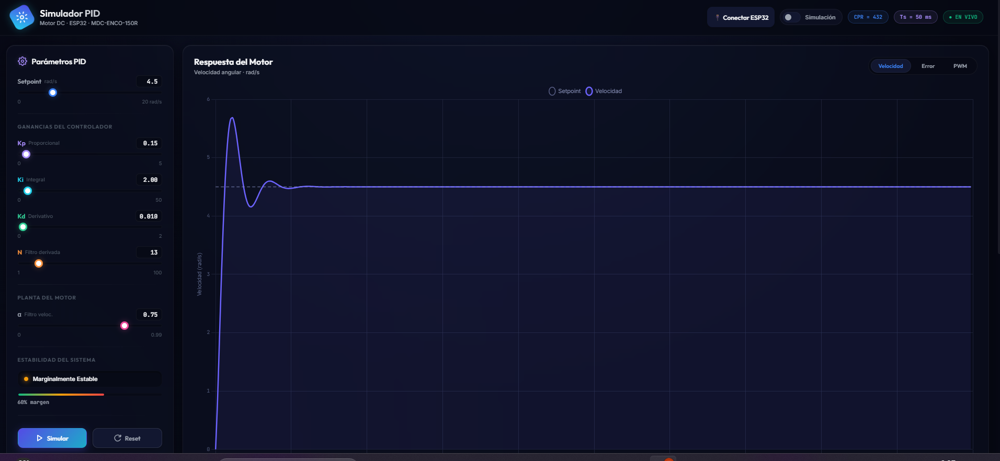
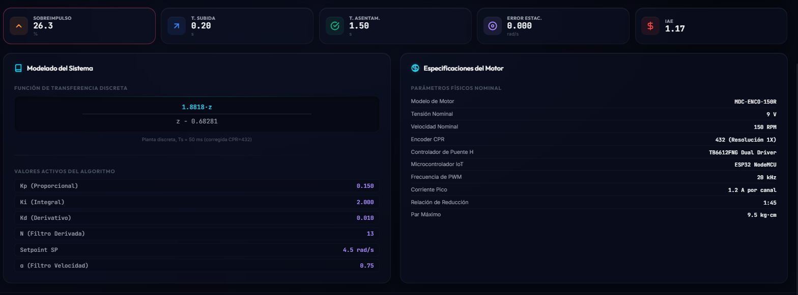
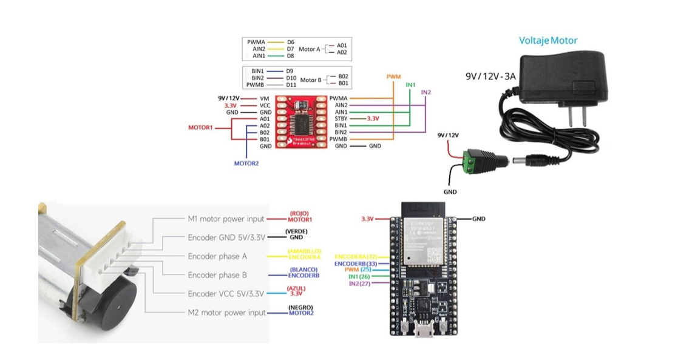
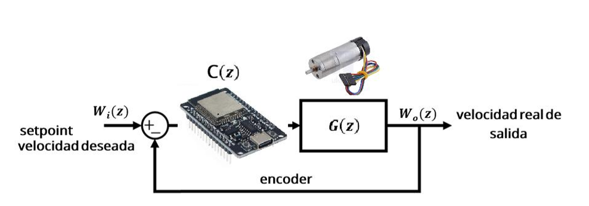

# DC Motor PID Control and Monitoring System

## 📖 Descripción

Este proyecto implementa un sistema completo de control de velocidad para un motor DC utilizando un ESP32, un encoder incremental y un controlador PID discreto.

El sistema integra una interfaz web para monitoreo y ajuste de parámetros en tiempo real, permitiendo modificar el setpoint y las ganancias del controlador directamente desde el navegador sin necesidad de reprogramar el microcontrolador.

Además, el proyecto incluye la identificación experimental de la planta mediante respuesta al escalón, el diseño del controlador PID y herramientas de análisis para la sintonización automática de parámetros.

## 🎥 Demostración en Video

Se realizó una demostración del funcionamiento completo del sistema, incluyendo:

- Control de velocidad del motor DC.
- Monitoreo en tiempo real.
- Ajuste de parámetros PID.
- Visualización mediante el dashboard web.
- Respuesta del sistema ante cambios de referencia.

📺 Video demostrativo:

https://youtu.be/UhuRdSovSp0

También puedes acceder directamente desde la siguiente imagen:

[](https://youtu.be/UhuRdSovSp0)

---

## 🚀 Características

- Control PID de velocidad en tiempo real.
- Medición mediante encoder incremental.
- Driver TB6612FNG para accionamiento del motor.
- Dashboard web responsivo.
- Ajuste dinámico de parámetros PID.
- Visualización de velocidad, PWM y referencia en tiempo real.
- Registro de datos experimentales.
- Identificación de la planta mediante respuesta al escalón.
- Sintonización automática del controlador mediante scripts de análisis.
- Arquitectura modular para futuras mejoras.

---

## ⚙️ Hardware utilizado

- ESP32 Dev Module
- Motor DC MDC-ENCO-150R-9.5KG
- Encoder incremental integrado
- Driver TB6612FNG
- Fuente de alimentación de 9 V

---

## 🧠 Parámetros del controlador

| Parámetro | Valor |
|-----------|--------|
| Kp | 0.45 |
| Ki | 11.0 |
| Kd | 0.30 |
| N | 10 |
| Ts | 50 ms |
| Setpoint | 14 rad/s |
| CPR | 432 pulsos/vuelta |

---

## 🖥️ Dashboard Web

El sistema incorpora una interfaz web para monitorear el comportamiento del motor y modificar los parámetros del controlador en tiempo real.

### Funciones disponibles

- Visualización de velocidad angular.
- Visualización de la señal PWM aplicada.
- Ajuste de setpoint.
- Ajuste de Kp, Ki y Kd.
- Monitoreo de variables del controlador.
- Interfaz amigable para pruebas y validación experimental.

### Capturas

#### Dashboard principal



#### Dashboard de monitoreo



---

## 🌐 Ejecución del Dashboard Web

El proyecto incluye una interfaz web que permite monitorear el comportamiento del motor y ajustar los parámetros del controlador PID en tiempo real.

### 1. Instalar dependencias

```bash
pip install -r requirements.txt
```

### 2. Iniciar el servidor web

Desde la carpeta raíz del proyecto ejecute:

```bash
python server/app.py
```

o en Windows:

```bash
py server/app.py
```

Al iniciar correctamente, el servidor mostrará el siguiente mensaje:

```text
Iniciando servidor local en http://localhost:7171
```

### 3. Abrir el dashboard

Ingrese desde cualquier navegador a:

```text
http://localhost:7171
```

Desde la interfaz es posible:

- Visualizar la velocidad angular del motor en tiempo real.
- Monitorear la señal PWM aplicada al actuador.
- Modificar el setpoint del sistema.
- Ajustar los parámetros Kp, Ki y Kd sin necesidad de recompilar el firmware.
- Analizar el desempeño del controlador durante la operación.

---

## 📈 Identificación de la Planta

La identificación del modelo dinámico del motor se realiza mediante el método de respuesta al escalón.

### Procedimiento

1. Cargar el firmware de adquisición de datos:

```text
firmware/step_response/step_response.ino
```

2. Aplicar una entrada escalón al motor.

3. Registrar la respuesta del sistema mediante el encoder.

4. Exportar los datos experimentales obtenidos a:

```text
data/step_response.csv
```

5. Utilizar los datos registrados para estimar la función de transferencia de la planta.

### Información necesaria

Para identificar correctamente la función de transferencia es indispensable disponer de:

- La señal de entrada aplicada al motor.
- La respuesta al escalón medida por el encoder.
- Los datos experimentales almacenados en `step_response.csv`.

Estos datos permiten modelar matemáticamente la dinámica del sistema y posteriormente diseñar y validar el controlador PID.

---

## 🤖 Sintonización Automática del PID

El proyecto incluye herramientas de análisis para calcular parámetros adecuados del controlador PID a partir de los datos experimentales obtenidos durante la identificación.

Script principal:

```text
analysis/autotuning.py
```

Este script procesa la respuesta al escalón y facilita el ajuste de las ganancias del controlador.

---

## 🔌 Esquema del Sistema

### Circuito de conexión



### Diagrama de control PID



---

## 📂 Estructura del Proyecto

```text
PID-Motor-Control/
│
├── analysis/
│   └── autotuning.py
│
├── data/
│   └── step_response.csv
│
├── docs/
│   ├── Identificacion_Modelo_Motor_DC.pdf
│   └── Practica_Control_PID.pdf
│
├── firmware/
│   ├── PID_MOTOR/
│   │   └── PID_MOTOR.ino
│   │
│   └── step_response/
│       └── step_response.ino
│
├── images/
│   ├── dashboard1.png
│   ├── dashboard2.png
│   ├── Esquema_circuito.png
│   └── esquema_PID.png
│
├── server/
│   └── app.py
│
├── web/
│   ├── index.html
│   ├── style.css
│   └── pid_sim.js
│
├── requirements.txt
├── README.md
└── LICENSE
```

---

## 📚 Documentación

La carpeta `docs/` contiene:

- Informe de identificación del sistema.
- Modelado matemático del motor DC.
- Diseño y análisis del controlador PID.
- Resultados experimentales.
- Evaluación del desempeño del sistema.

---

## 👥 Autores

- Tamara Valeria Escobar Andrade
- Santiago Rodríguez Bermeo
- Dania Sofía Serrano Perdomo
- Thomas Trujillo Cerquera

**Programa de Ingeniería Mecatrónica**

---

## 📄 Licencia

Este proyecto se distribuye bajo la licencia MIT.

---

## 🙏 Agradecimientos

Agradecemos a la comunidad de desarrollo de ESP32, Arduino y Python por las herramientas y recursos que hicieron posible este proyecto.

---

⭐ Si este proyecto te resulta útil, considera darle una estrella al repositorio.
